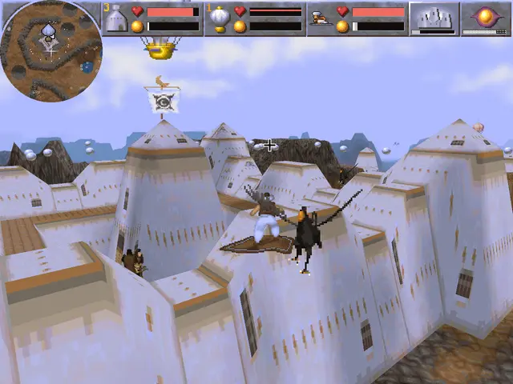
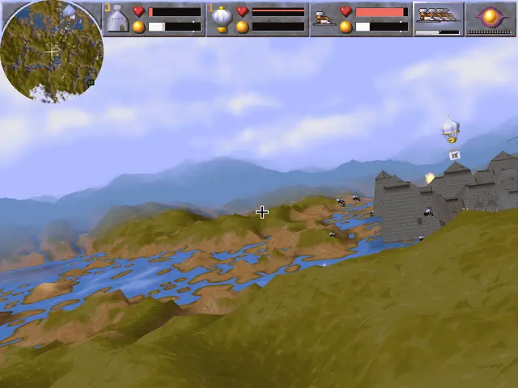
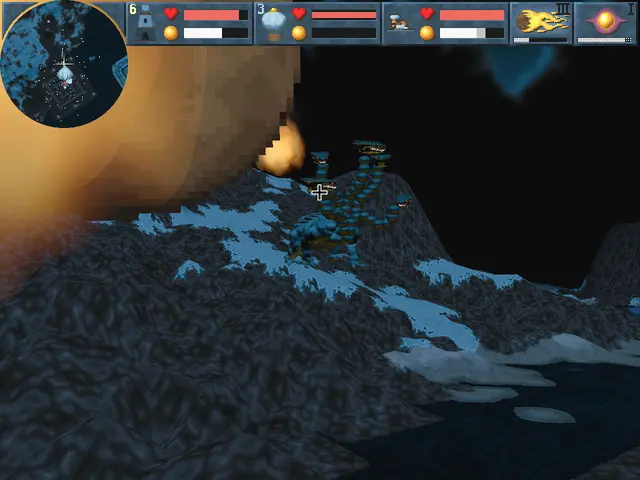

# mgcarpet

A modern, cross-platform engine reimplementation of Bullfrog's
**Magic Carpet** (1994), its **Hidden Worlds** expansion, and
**Magic Carpet 2: The Netherworlds** (1995), written from scratch in Rust
on wgpu (WGSL shaders), winit and cpal.

Questions, bug reports, playtesting: the Magic Carpet Discord —
https://discord.gg/GR55HCbJJ4

## About

This is a from-scratch engine reimplementation: it ships no game content and
requires original game data from a legally owned copy (both games are sold
on [GOG](https://www.gog.com/en/game/magic_carpet) —
[MC2 here](https://www.gog.com/en/game/magic_carpet_2_the_netherworlds)).
The goal is one engine that plays both games and the expansion — with
fixed-timestep simulation (game speed independent of framerate), GPU
rendering with real draw distance, save-anywhere, and modern platform
support — while treating the original gameplay as the specification:
behavioral fidelity by default, deviations deliberate and opt-in.

It is built with heavy use of Claude Code (Fable / Opus) as well as other
AI tools.





## Quickstart (playtesting)

1. Get the `mgcarpet` binary: a
   [release](../../releases) archive for Linux, Windows or macOS, or
   build it yourself (below). The macOS archive is a universal binary
   (Apple Silicon + Intel) that CI builds and unit-tests but nobody has
   yet played on real hardware — reports welcome. It is unsigned, so
   macOS quarantines it on download; release it once with
   `xattr -dr com.apple.quarantine <the unpacked folder>` (or right-click
   → Open on the binary).
2. Copy your installed GOG game directories into a `gamedata/` folder
   next to the binary — see [gamedata/README.md](gamedata/README.md)
   for the expected layout. Any subset works (MC1 only is fine).
3. Run it. Starting `mgcarpet` with no arguments opens the
   **launcher**: pick one of the three games (a game whose data is not
   baked yet is crossed out) and press Start. You can also skip it and
   double-click the campaign launcher for the game you want to play:

   * `magic-carpet-1` — the Magic Carpet campaign
   * `magic-carpet-hidden-worlds` — the Hidden Worlds campaign
   * `magic-carpet-2` — the Magic Carpet 2 campaign

   Each one simply starts `mgcarpet --campaign <game>` from its own
   folder: level order, exits and retail-format saves included.

   The `mgcarpet` binary itself does the same and more, from a shell:

   ```sh
   ./mgcarpet                 # the launcher

   ./mgcarpet --level mc1:9   # a specific level (mc1 | mc1hw | mc2)

   # a full campaign (mc1 | mc1hw | mc2); like retail, it starts a
   # fresh unsaved run — save (or load) from the in-game menu, or
   # resume save slot N directly with --slot
   ./mgcarpet --campaign <game> [--slot N]
   ```

   On first run the game finds no baked data and **bakes it from your
   GOG installs automatically** (once per machine; also after an
   upgrade that changes the bake — the data carries an epoch stamp).
   The launcher does this in the background and lights up each game's
   card when it is done.
   To point elsewhere than `gamedata/`, set `MGC_GAMEDATA` or
   `"gamedata"` in `mgcarpet.json`.

   Most tweakable options are available in several ways:
   * Runtime menu (displayed when game is paused)
   * Key mappings for runtime toggles
   * CLI flags
   * json config file entries

   Notably, options that affect the sim as a whole can only be changed
   on startup, ie. NOT at runtime.

   Config lives in `mgcarpet.json` (sparse overrides) next to the
   generated `mgcarpet.json.defaults`, which documents every option with
   its faithful-authentic default. `--help` lists the CLI flags. To
   bootstrap `mgcarpet.json.defaults`, simply run the game once. Then copy
   the file to `mgcarpet.json` and make your desired tweaks.

## Current Status

Both games and the expansion are playable end to end. The simulation is
bit-exact against retail gameplay recordings across the certified takes,
strange and quirky retail behaviour included, and every remaining
divergence is registered rather than papered over.

Deviations from the retail game are deliberate — bug fixes or playability
improvements — and nearly all of them can be switched back to the retail
behaviour with a toggle.

The main issue of all retail Magic Carpet games is the dreaded entity pool
with its highly limited size and frequent overflows, resulting in strange
gameplay issues, sometimes crashes. This port turns it into a parameter
(default 20000 slots against retail's 1000; set `entity_pool_size` to
1000 for the retail limit), one of the main reasons why gameplay of
levels with heavy activity tends to be a lot smoother. Increasing the parameter also allows playing some of
the original hidden levels that were removed from the campaign for various
reasons, one of them being that they don't even load correctly due to limited
entity pool size.

Detailed conformance report is TODO.

## Architecture

```
gamedata/  (your GOG installs — never committed)
    │
    ▼
mgc-import  ── the only code that understands Bullfrog formats (RNC,
    │          DAT/TAB, XMI, seeded terrain generation). Runs once per
    │          machine; expands everything into baked packages. All
    │          procedural/seeded data is expanded here — the engine never
    │          sees a seed.
    ▼
mgc-formats ── the baked package format: the sole data contract
    │
    ▼
mgc-sim     ── pure, headless, deterministic simulation core
mgc-render  ── wgpu renderer (reads sim state, interpolates between ticks)
mgc-audio   ── cpal output + the ported original mixer + FLAC music
mgc-app     ── winit shell: window, input, fixed-timestep game loop
```

Verification strategy: original-engine output is the oracle. Expanded
terrain and parsed data are validated byte-for-byte against reference
dumps produced by the original code ([Magic Carpet 2 HD][remc2] for MC2,
instrumented DOSBox for MC1). Fixtures live outside git (derived from copyrighted data); their
SHA-256 hashes are committed as pins.

## Building

```sh
cargo build --workspace
cargo test --workspace
```

Rust 1.85+ (edition 2024). Linux needs the ALSA headers for audio
(`libasound2-dev` on Debian/Ubuntu, `alsa-lib` headers elsewhere);
Windows and macOS need no system dependencies.

## Game data

The engine consumes *baked* packages, generated from your GOG installs
under `gamedata/` — the game shell does this by itself on first run
(see Quickstart), and `mgc-import` exposes the same importer as a
standalone tool:

```sh
cargo run -p mgc-import -- scan gamedata   # integrity-check the data
cargo run -p mgc-import -- bake gamedata baked   # bake everything
```

## The level package format

Levels bake to `.mgcl` files — stored (uncompressed) ZIP containers with
JSON for structured data and raw binary for bulk grids, one schema
covering both games. The format is explicitly documented in
**[docs/FORMAT.md](docs/FORMAT.md)**; that document is normative and
evolves in lockstep with the code. Community-authored levels in this
format are original works and freely shareable (unlike packages baked
from the copyrighted game data, which stay on your machine).

## Credits and prior art

This project stands on years of community reverse engineering. It would
not exist without:

- **Tomáš Veselý (turican0)** — the original
  [remc2](https://github.com/turican0/remc2), the assembly→C++
  reconstruction of Magic Carpet 2 that made the engine family
  understandable at all.
- **Tim Hobbs (thobbsinteractive) and contributors** —
  [Magic Carpet 2 HD](https://github.com/thobbsinteractive/magic-carpet-2-hd),
  the actively maintained continuation of remc2, whose codebase serves as
  this project's behavioral reference, and whose `DataFileRNC`
  implementation our RNC decoder is ported from.
- **Michael Howard** —
  [MagicCarpetFileFormat](https://github.com/michaelhoward/MagicCarpetFileFormat),
  the MC1 level format specification our parser is built against.
- **Moburma** — [Magic Carpet tooling](https://github.com/Moburma)
  (MCDatExtractor, MCLevelReader, MCLevelEdit, BullfrogSoundExtractor)
  and the extensive unused-content documentation on
  [The Cutting Room Floor](https://tcrf.net/Magic_Carpet_(DOS)).
- **lab313ru** —
  [rnc_propack_source](https://github.com/lab313ru/rnc_propack_source),
  the decompiled original RNC ProPack.
- **Bullfrog Productions** — for the 1994 original that was so far ahead
  of its time we're still catching up to it.

## License

GPL-3.0-or-later. The RNC decompressor is ported from remc2's
implementation (itself derived from the decompiled original ProPack).

[remc2]: https://github.com/thobbsinteractive/magic-carpet-2-hd
